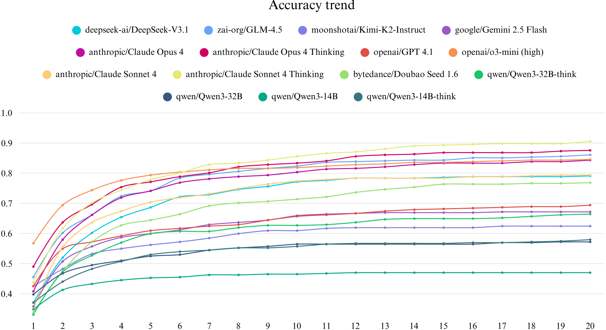

# 👑 Meeseeks Benchmark

β Previous Beta Version: https://github.com/ADoublLEN/Meeseeks-beta

## 📖 Introduction
**Meeseeks** is an **instruction-following benchmark** designed to evaluate how well models can adhere to user instructions in a **multi-turn scenario**.  
A key feature of Meeseeks is its **self-correction loop**, where models receive structured feedback and must refine their responses accordingly.  

This benchmark provides a realistic evaluation of a model’s **adaptability, instruction adherence, and iterative improvement**.

---

## 📊 Leaderboard

---

## 🍄‍🟫 A Quick Example

<table style="text-align: center; width: 60%; margin: 0 auto;">
<thead>
<tr style="background-color: #f0f0f0;">
  <th style="text-align: center; width: 20%; font-weight: bold;">ROUND1-Input</th>
  <th style="text-align: center; width: 50%; font-weight: bold;">Evaluation Content</th>
  <th style="text-align: center; width: 30%; font-weight: bold;">Capability tags</th>
</tr>
</thead>
<tbody>
<tr>
  <td rowspan="5" style="text-align: center; vertical-align: middle; width: 150px; max-width: 150px; word-wrap: break-word; font-size: 12px; padding: 6px; line-height: 1.3; font-weight: normal;">Generate 32 colloquial user comments and 40 formal user comments from a consumer perspective in short video comment sections. Each comment should be exactly 7 characters long and must not contain the following words:["this", "good", "that"]</td>
  <td style="text-align: center; font-weight: normal;">Whether 32 colloquial user comments were generated</td>
  <td style="text-align: center; font-weight: normal;">Element number requirement</td>
</tr>
<tr>
  <td style="text-align: center; font-weight: normal;">Whether 40 formal user comments were generated</td>
  <td style="text-align: center; font-weight: normal;">Element number requirement</td>
</tr>
<tr>
  <td style="text-align: center; font-weight: normal;">Whether all comments are exactly 7 characters</td>
  <td style="text-align: center; font-weight: normal;">Generate in 0∼10 words、Generate at accurate word number</td>
</tr>
<tr>
  <td style="text-align: center; font-weight: normal;">Whether comments are non-repetitive</td>
  <td style="text-align: center; font-weight: normal;">Generate repeat/non-repeat content</td>
</tr>
<tr>
  <td style="text-align: center; font-weight: normal;">Whether comments do not contain forbidden words: ["this", "good", "that"]</td>
  <td style="text-align: center; font-weight: normal;"> Generate with certain keywords</td>
</tr>
<tr style="background-color: #f0f0f0;">
  <td colspan="3" style="text-align: center; font-weight: normal;">💡 <strong>Let's activate multi-round mode!</strong></td>
</tr>
<tr style="background-color: #f0f0f0;">
  <td colspan="3" style="text-align: center; font-weight: normal;"><strong>ROUND2 - Input (if ROUND1 model output fails to meet requirement: "Whether all comments are exactly 7 characters")</strong></td>
</tr>
<tr>
  <td colspan="3" style="text-align: center; word-wrap: break-word; font-weight: normal;">Your response has the following issues: Whether all comments are exactly 7 characters: ❌ Content character count does not match range[7, 7] [mom prouds of you] character count: 4 Please provide your corrected response based on this information. Note: Only output the answer, do not output additional information.</td>
</tr>
<tr style="background-color: #f0f0f0;">
  <td colspan="3" style="text-align: center; font-weight: normal;"><strong>ROUND3 - Input ...</strong></td>
</tr>
<tr>
  <td colspan="3" style="text-align: center; font-weight: normal;">...</td>
</tr>
</tbody>
</table>

---

## 🚀 Quick Start

We provide three example scripts to help you get started quickly:

- **`example_run_chinese.sh`** → Run Meeseeks (Chinese) dataset  
- **`example_run_english.sh`** → Run Meeseeks (English) dataset  
- **`example_run_custom.sh`** → Run your own dataset  

> ℹ️ **Note:**  
> Meeseeks (English) and Meeseeks (Chinese) share the **same content**, but their **evaluation pipelines are different**.

---

## ⚙️ Requirements

Before running any script, you must implement **three model APIs**:

1. **Test Model**  
   - Argument: `--tested_model_url`  
   - The model you want to evaluate.  

2. **Extract Model** *(Recommended: `Qwen2.5-Coder-32B-Instruct`)*  
   - Argument: `--qwen_url`  
   - Used to extract structured outputs from model responses.  

3. **Score Model** *(Recommended: `Qwen2.5-32B-Instruct`)*  
   - Argument: `--qwen_coder_url`  
   - Used to evaluate and score the extracted results.  

---

## 💡 Hardware & API Options

- If you **have a GPU**:  
  We recommend using the open-source **Qwen2.5 series** models for extraction and scoring.  

- If you **don’t have a GPU**:  
  You can use **commercial APIs** instead.  
  - ✅ *Highly recommended:* **Claude 3.7 Sonnet**  
  - Alternative APIs may also be integrated as long as they follow the input/output format.  

---

## 📂 Results

- Chinese evaluation results will be stored in:  
evaluation_results_chinese/
- English evaluation results will be stored in:  
evaluation_results_english/

Each directory contains structured logs, extracted outputs, and scoring results for further analysis.